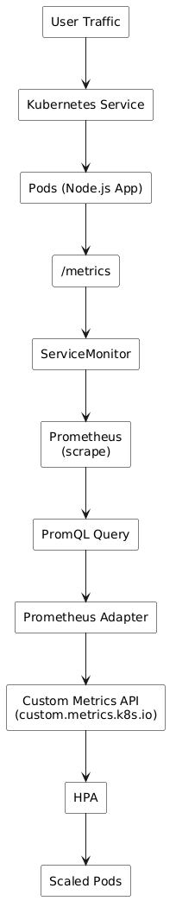
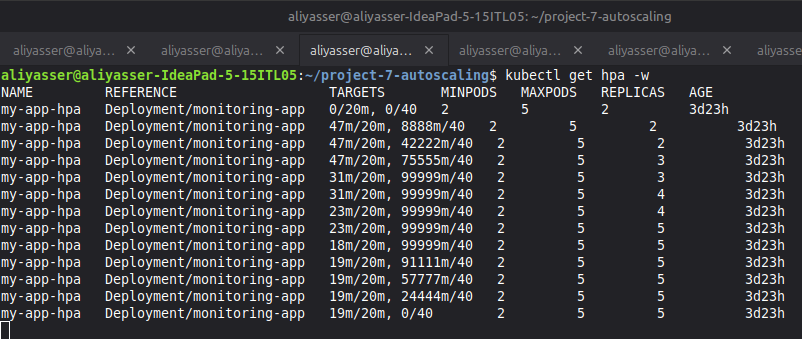
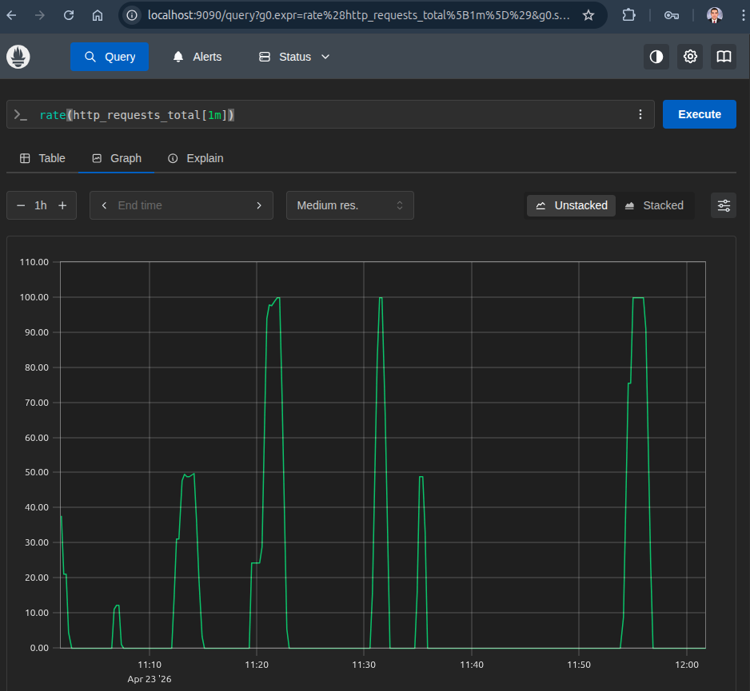
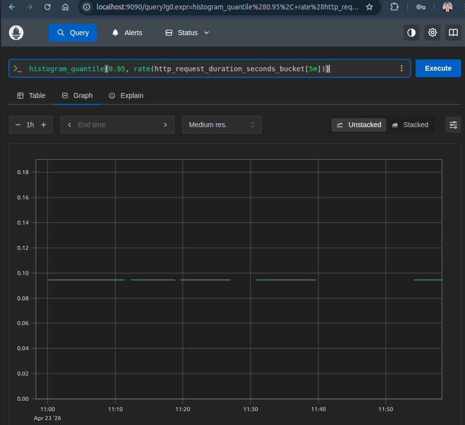
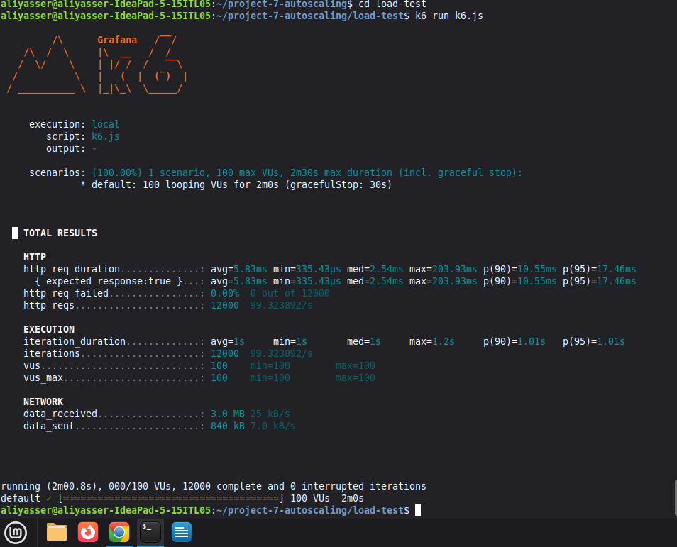

# Kubernetes Custom Metrics Autoscaling

A production-style Kubernetes project demonstrating advanced autoscaling using Prometheus
custom metrics, including:
* Request-based scaling (traffic)
* Latency-based scaling (P95)
* Controlled scaling behavior (scale up/down policies)
* Full observability using Prometheus & Grafana
* Load testing with k6

### - **This project builds upon a prior monitoring system [ project 5 ] and evolves it into a self-regulating architecture that automatically scales based on real user experience and traffic load.**

# Architecture


# Tech Stack

* Node.js
* Docker
* Kubernetes
* Prometheus (kube-prometheus-stack via Helm)
* Prometheus Adapter (custom metrics)
* Grafana
* k6 (load testing)


# Key Features

### Custom Metrics

* `http_requests_total` --> request rate
* `http_request_duration_seconds` --> latency histogram (P95)

### Autoscaling Strategy

1) Multi-metric HPA:
  * Requests per pod
  * Latency (P95)
    
2) Controlled scaling behavior:
  * Gradual scale up
  * Gradual scale down

### Observability

* Prometheus scrapes metrics via ServiceMonitor
* Real-time metrics visualization
* Latency and traffic monitoring


# Demo (Screenshots)

### 1. HPA Scaling Shows:
Scaling Pattern: `2 → 3 → 4 → 5 pods`
Latency Target (P95): `20 ms`
Request Rate Target: `40 requests/sec per pod` 


### 2. Request Rate (Prometheus)
```rate(http_requests_total[1m])```


### 3. Latency P95
```histogram_quantile(0.95, rate(http_request_duration_seconds_bucket[5m]))```


# Load Testing
Load is generated using k6:
```bash k6 run load-test/k6.js```


Example output:
* ~100 requests/sec


# How to Run

### 1. Start Kubernetes
```bash
minikube start
```

### 2. Deploy Monitoring Stack (Prometheus)
```bash
helm install monitoring prometheus-community/kube-prometheus-stack
```

---

### 3. Deploy Application
```bash
kubectl apply -f k8s/app/
```

### 4. Deploy ServiceMonitor
```bash
kubectl apply -f k8s/monitoring/
```

### 5. Install Prometheus Adapter
```bash
helm install prometheus-adapter prometheus-community/prometheus-adapter \
  -f helm/adapter-values.yaml
```

### 6. Deploy HPA
```bash
kubectl apply -f k8s/autoscaling/hpa.yaml
```

### 7. Run Load Test
```bash
k6 run load-test/k6.js
```

### 8. Watch Scaling
```bash
kubectl get hpa -w
kubectl get pods -w
```

# HPA Configuration (Core Idea)
```yaml
Latency Target:   20ms
Requests Target:  40 req/sec per pod
Replicas:         2 → 5
```

Scaling triggers when:
* latency increases OR
* request rate increases


# Results
* System scales automatically under load
* Latency decreases after scaling
* Pods scale down when load stops
* Stable and controlled behavior

# What I Learned
* How Prometheus custom metrics integrate with Kubernetes
* Difference between CPU-based and metric-based autoscaling
* How to design latency-based scaling (P95)
* How HPA makes scaling decisions
* Importance of stabilization windows and scaling policies
* Real-world autoscaling trade-offs (performance vs cost)

# Key Insight
* Autoscaling should be based on user experience (latency), not just resource usage.

# Author
Ali Yasser,
DevOps Engineer
